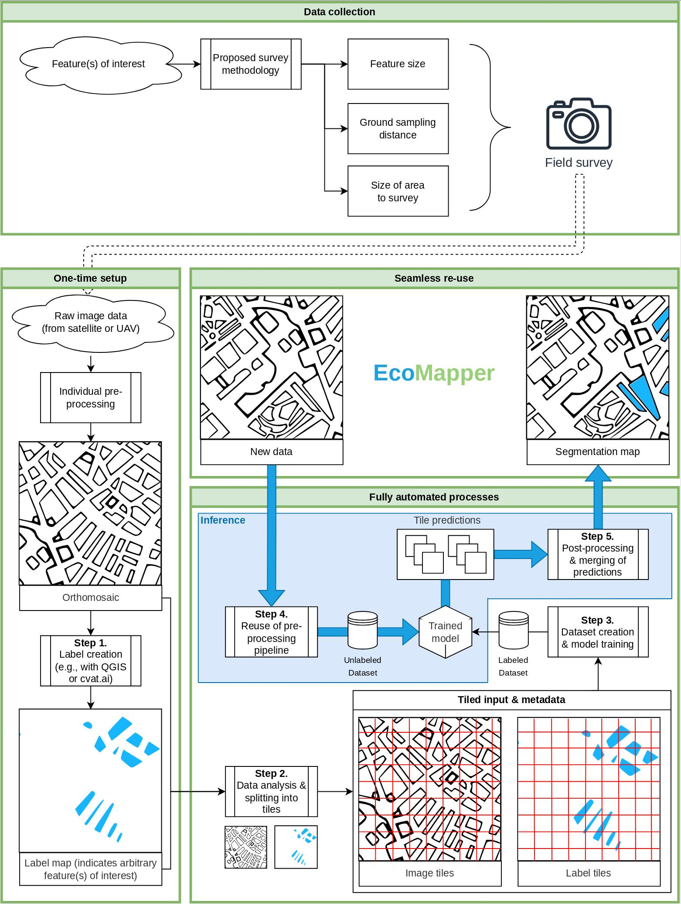

# Segmentation of arbitrary features in very high resolution remote sensing imagery


This is the code repository for my M.Sc. thesis at Imperial College London,
"[Segmentation of arbitrary features in very high resolution remote sensing imagery](https://arxiv.org/abs/2412.16046v1)".

The initial code version at time of publication on arXiv is tagged `v1.0`. The codebase may evolve in the future with
new features, bugfixes, etc.

## Abstract

<details>

<summary>Click to expand</summary>

Very high resolution (VHR) mapping through remote sensing (RS) imagery presents
a new opportunity to inform decision-making and sustainable practices in
countless domains. Efficient processing of big VHR data requires automated
tools applicable to numerous geographic regions and features. Contemporary RS
studies address this challenge by employing deep learning (DL) models for
specific datasets or features, which limits their applicability across
contexts.

The present research aims to overcome this limitation by introducing EcoMapper,
a scalable solution to segment arbitrary features in VHR RS imagery. EcoMapper
fully automates processing of geospatial data, DL model training, and
inference. Models trained with EcoMapper successfully segmented two distinct
features in a real-world UAV dataset, achieving scores competitive with prior
studies which employed context-specific models.

To evaluate EcoMapper, many additional models were trained on permutations of
principal field survey characteristics (FSCs). A relationship was discovered
allowing derivation of optimal ground sampling distance from feature size,
termed Cording Index (CI). A comprehensive methodology for field surveys was
developed to ensure DL methods can be applied effectively to collected data.



</details>


## Installation

<details>

<summary>Click to expand</summary>

First, check if conda is already installed by running:

```shell
conda --version
# Should print: conda <some version>
```

If an error is reported, install `miniconda`
from https://docs.conda.io/en/latest/miniconda.html or use `miniforge`, which provides `mamba` as a
faster alternative:
https://github.com/conda-forge/miniforge

Next, update conda:

```shell
conda update -n base -c conda-forge conda -y
```

Create an environment and activate it. Be sure to use Python __3.10__ as shown.

```shell
conda create -n ecomapper python=3.10 GDAL=3.7.2 -y
conda activate ecomapper
```

Update pip and install the project dependencies:

```shell
pip install --upgrade pip
pip install -r requirements.txt
```

Install MMCV (be sure to use `mim` instead of `pip`!)

```shell
mim install "mmcv==2.0.0"
```

Install MMSegmentation and MMDetection

```shell
pip install git+https://github.com/open-mmlab/mmsegmentation@30a3f94f3e2916e27fa38c67cc3b8c69c1893fe8
pip install git+https://github.com/open-mmlab/mmdetection@ecac3a77becc63f23d9f6980b2a36f86acd00a8a
```

</details>

## Usage

Please refer to [the quickstart guide](QUICKSTART.md).

## Development

### Generating documentation

Build modules (only if any modules were changed):

```shell
sphinx-apidoc -M -f -o docs/ ./ecomapper
```

Generate documentation:

```shell
python -m sphinx -b html docs/ docs/_build/
```

After building, you can open the HTML documentation from `docs/_build/index.html`.

### Running tests

Please note that some tests in `tests/functional` are computationally expensive
and may take longer to complete on CPU-only systems. Using a dedicated GPU is recommended.

To run tests:
```shell
pytest
```

### Linting with flake8

```shell
python -m flake8
```

### Type checking with Pytype

```shell
python -m pytype
```

### Regenerating `requirements.txt`

```shell
uv pip compile --universal --output-file=requirements.txt requirements.in
```

Afterwards, sync the requirements:

```shell
uv pip sync requirements.txt

mim install "mmcv==2.0.0"
pip install git+https://github.com/open-mmlab/mmsegmentation@30a3f94f3e2916e27fa38c67cc3b8c69c1893fe8
pip install git+https://github.com/open-mmlab/mmdetection@ecac3a77becc63f23d9f6980b2a36f86acd00a8a
mamba install GDAL==3.7.2 -y
```

## License

The repository uses the GPL v3 license. If this is significantly constricting you, please reach out to me!

[License](LICENSE)

## Citation

If you find this work useful, please cite:

DOI: https://doi.org/10.48550/arXiv.2412.16046

Bibtex:

```
@misc{cording2024segmentationarbitraryfeatureshigh,
      title={Segmentation of arbitrary features in very high resolution remote sensing imagery}, 
      author={Henry Cording and Yves Plancherel and Pablo Brito-Parada},
      year={2024},
      eprint={2412.16046},
      archivePrefix={arXiv},
      primaryClass={cs.CV},
      url={https://arxiv.org/abs/2412.16046}, 
}
```

## To-do list

- [ ] Include additional models from MMSegmentation for training
- [ ] Mute MMSegmentation output and write to log file instead
- [ ] Working verbosity; use `logging` for all messages
- [ ] Template generator that can be used to fill out a task and submit it
  (useful for headless HPC environments)
- [ ] Wider test coverage
- [ ] Improved documentation, publish docs on readthedocs
